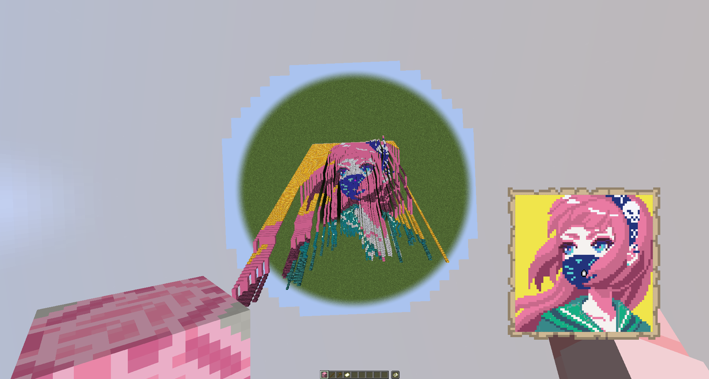

# WaxMapArt



>## Table of content
>- [Generating Preview](#rendering-preview-of-map-c)
>- [Generating Schematic](#generating-schematic-file-nbt-c)

### Rendering preview of map (C#)
```csharp
using Newtonsoft.Json;
using SixLabors.ImageSharp;
using SixLabors.ImageSharp.PixelFormats;
using WaxMapArt;

// Load the default palette.
Palette palette = JsonConvert.DeserializeObject<Palette>(File.ReadAllText("palette.json"));
// Load image from path.
Image<Rgb24> image = Image.Load<Rgb24>("image.jpg");

// Create the configuration to generate preview.
Preview preview = new Preview(palette)
{
    // Change the color comparison method.
    Method = ComparisonMethod.Cie76,
    // Amount of maps (X = width, Y = height).
    MapSize = new WaxSize(1, 1),
    // Change the output size of the preview image.
    OutputSize = new WaxSize(512, 512)
};

// Generate the preview.
PreviewOutput previewOutput = preview.GeneratePreviewStaircase(image); // Or preview.GeneratePreviewFlat(image) for flat generation

// Save the preview in a file.
previewOutput.Image.SaveAsPng("preview.png");

// Interact with all necessary blocks.
foreach (var (mapId, count) in previewOutput.BlockList)
{
    int packs = count / 64;
    int rem = count % 64;
    double shulkers = Math.Truncate(packs / 27f * 100) / 100;
    
    string packCount = packs > 0 ? $"{packs} packs + {rem}" : count.ToString();
    // Get the block id from the map id.
    string id = palette.Colors[mapId.ToString()].BlockId;
    
    // Print the result.
    Console.WriteLine(id);
    Console.WriteLine($"Shulker box: {shulkers}");
    Console.WriteLine(packCount);
    Console.WriteLine();
}
```

### Generating schematic file (NBT) (C#)

```csharp
using Newtonsoft.Json;
using SixLabors.ImageSharp;
using SixLabors.ImageSharp.PixelFormats;
using WaxMapArt;

// Load the default palette.
Palette palette = JsonConvert.DeserializeObject<Palette>(File.ReadAllText("palette.json"));
// Load image from path.
Image<Rgb24> image = Image.Load<Rgb24>("image.jpg");

// Create the configuration to generate blocks.
Generator generator = new Generator(palette)
{
    // Change the color comparison method.
    Method = ComparisonMethod.Cie76,
    // Amount of maps (X = width, Y = height).
    MapSize = new WaxSize(1, 1),
    // Change the output size of the preview image.
    OutputSize = new WaxSize(512, 512)
};

// Generate the list of blocks.
GeneratorOutput generatorOutput = generator.GenerateStaircase(image); // Or generator.GenerateFlat(image) for flat generation

// Save the preview in a file.
generatorOutput.Image.SaveAsPng("preview.png");

// Interact with all necessary blocks.
foreach (var (info, count) in generatorOutput.CountBlocks())
{
    int packs = count / 64;
    int rem = count % 64;
    double shulkers = Math.Truncate(packs / 27f * 100) / 100;
    
    string packCount = packs > 0 ? $"{packs} packs + {rem}" : count.ToString();
    // Get the block id from the map id.
    string id = info.BlockId;
    
    // Print the result.
    Console.WriteLine(id);
    Console.WriteLine($"Shulker box: {shulkers}");
    Console.WriteLine(packCount);
    Console.WriteLine();
}

// Finally, generate the NBT.
Stream stream = NbtGenerator.Generate(generatorOutput.Blocks);
// Save the NBT.
using FileStream fs = File.Create("schematic.nbt");
stream.CopyTo(fs);

stream.Close();
fs.Close();
```
